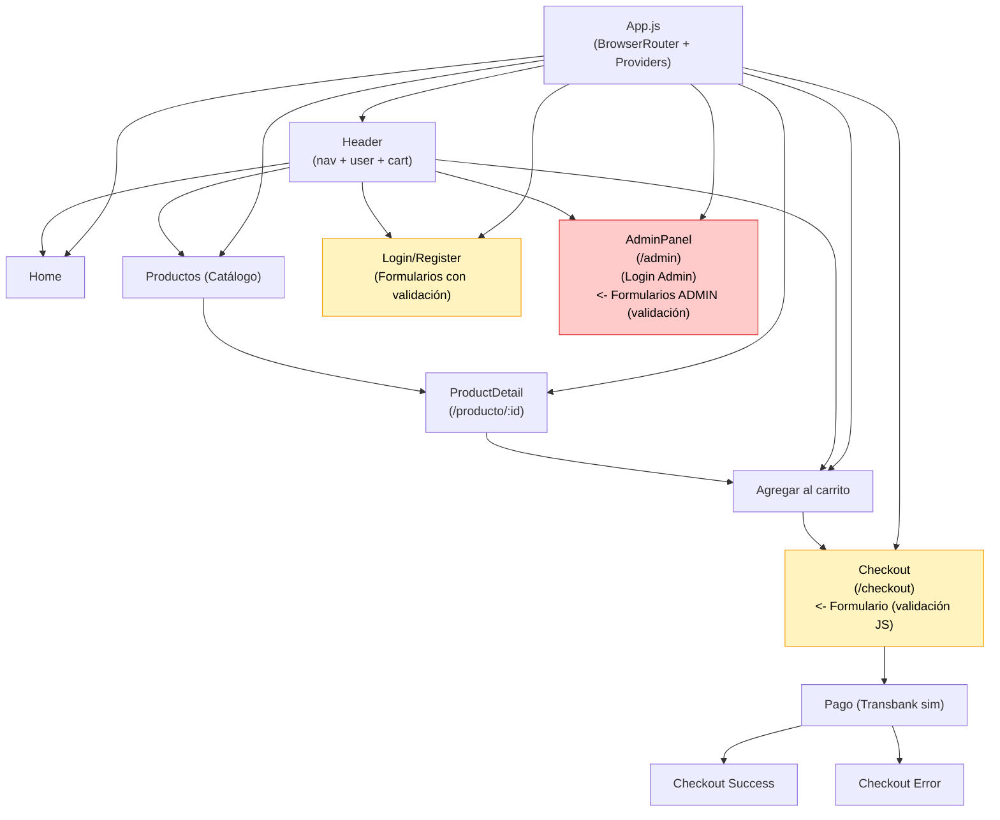

# Diagrama de flujo de navegación del proyecto (Visión General)

Formato: Mermaid (recomendado para render). Debajo está la versión ASCII.

Versión ASCII rápida:

App.js (Router + Providers)
├─ Header (nav, user, cart)
├─ Home
├─ Productos --> ProductDetail
│    └─ (Agregar al Carrito)
├─ Carrito --> Checkout (Formulario con validación JS)
│    └─ Pago (Transbank sim) -> Success / Error
├─ Login / Register (Formularios con validación JS)
└─ AdminPanel (requiere role admin) -> Tabs (Dashboard, Productos, Usuarios, Órdenes, Ofertas)
    ├─ Formularios de Admin: Crear/Editar Producto (validación), Crear/Editar Usuario (validación), Importar JSON

Leyenda:
- Nodos en amarillo: vistas con formularios y validación JS (Login, Register, Checkout)
- Nodos en rojo: panel administrativo y sus formularios (más sensibles)

Recomendación de uso:
- Renderizar el diagrama Mermaid en VS Code con la extensión "Markdown Preview Mermaid Support" o pegando en https://mermaid.live para exportar PNG/SVG.
- Usa la versión ASCII para documentación rápida o impresiones simples.
